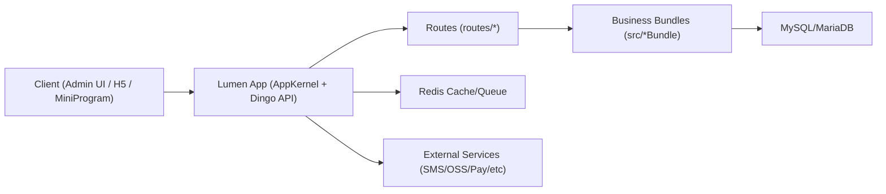

# ECShopX 项目框架结构图

**目录结构概览**
```
ECShopX/
- app/               应用核心与内核扩展（AppKernel、helpers）
- bootstrap/         启动与路由分发（app.php、route.php）
- config/            配置（api、database、jwt、app 等）
- routes/            路由分组（api、admin、frontapi、super、systemlink 等）
- src/               业务模块（*Bundle）
- public/            Web 入口（index.php）
- resources/         资源文件
- storage/           日志与缓存
- vendor/            Composer 依赖
```

**架构示意（简图）**


**路由分发说明**
- `app/AppKernel.php` 按路径分段决定加载哪个路由文件。
- `bootstrap/route.php` 根据 `dingoRoutingKeyOne` 选择 `routes/` 子目录。
- API 前缀默认是 `/api`（见 `config/api.php`）。
