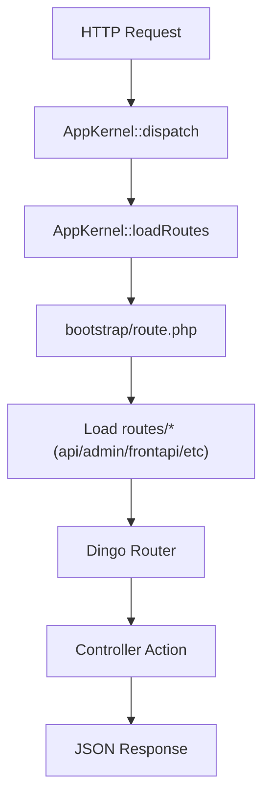
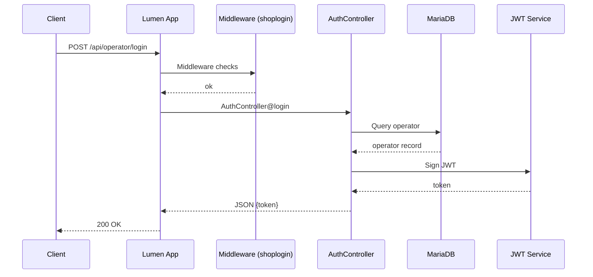

# ECShopX 代码流程图

**请求路由分发流程（概览）**

```mermaid
flowchart TD
    R["HTTP Request"] --> AK["AppKernel::dispatch"]
    AK --> LR["AppKernel::loadRoutes"]
    LR --> BR["bootstrap/route.php"]
    BR --> RF["Load routes/* (api/admin/frontapi/etc)"]
    RF --> Dingo["Dingo Router"]
    Dingo --> C["Controller Action"]
    C --> Resp["JSON Response"]
```

**登录接口流程（/api/operator/login）**

```mermaid
sequenceDiagram
    participant C as Client
    participant S as Lumen App
    participant M as Middleware (shoplogin)
    participant A as AuthController
    participant DB as MariaDB
    participant J as JWT Service

    C->>S: POST /api/operator/login
    S->>M: Middleware checks
    M-->>S: ok
    S->>A: AuthController@login
    A->>DB: Query operator
    DB-->>A: operator record
    A->>J: Sign JWT
    J-->>A: token
    A-->>S: JSON {token}
    S-->>C: 200 OK
```
